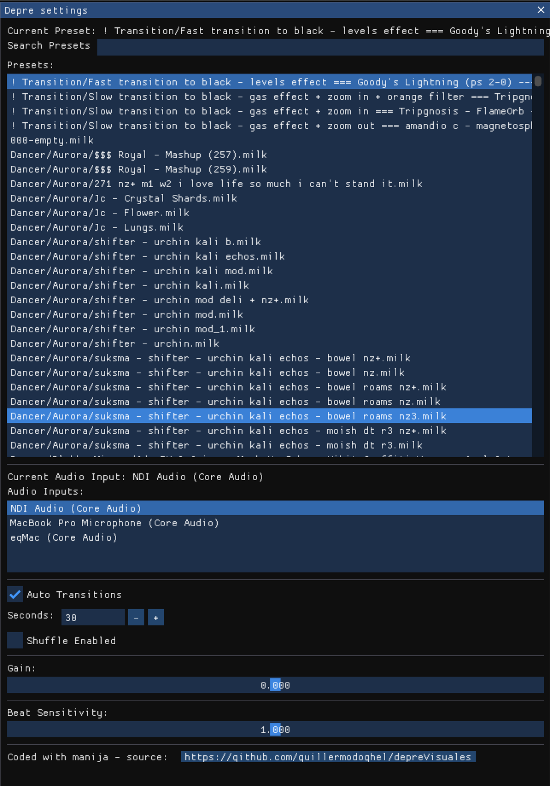

# DepreVisuales

Las visuales más depre de GitHub.

DepreVisuales is a visualization tool that implements projectM to render audio from an audio input source.
projectM is an open-source project that reimplements the
esteemed [Winamp Milkdrop](https://en.wikipedia.org/wiki/MilkDrop) by Geiss in a modern, cross-platform reusable
library.

## Features

- Renders audio visualizations using projectM.
- Includes 9000+ presets for diverse visual experiences.
- Automatically changes presets if the framerate drops below 30fps or the screen is all black.
- Manual preset change with the spacebar.
- Settings window accessible with the tab key.

## Instructions

### Getting Started

1. **Clone the Repository:**

   ```sh
   git clone https://github.com/yourusername/depreVisuales.git
   cd depreVisuales
   ```


2. **Initialize Submodules::**

   ```
   git submodule update --init --recursive
   ```

3. **Install Dependencies:**

    ```
    brew install glfw glew glm fftw pulseaudio
    ```


4. **Build and Install projectM:**

build and install `dependencies/projectm` following the instructions in the repo. you may have to install other
dependencies, like `libglew-dev` and `libglfw3-dev`.
More instructions here https://github.com/projectM-visualizer/projectm/wiki/Building-libprojectM

   ```
   cd dependencies/projectm
   mkdir build
   cd build
   cmake .. -DCMAKE_INSTALL_PREFIX=../bin
   make
   make install
   ```

//line


### This repo included 9000+ presets. Build, run and enjoy.


To filter glitchy presets, the program automatically changes the preset if the framerate drops below 30fps, or if the
screen is all black.

Press spacebar to change the preset manually.

Press tab to open the settings window.




